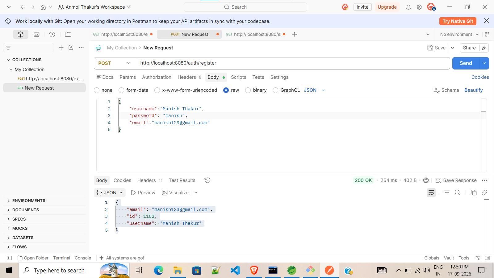
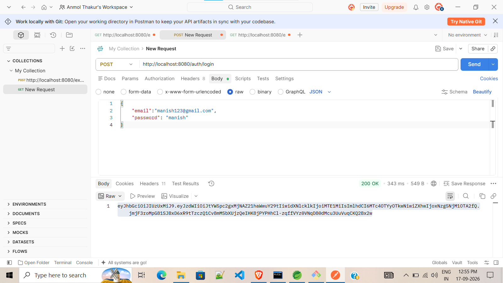

# Expense Manager REST API

A Spring Boot based REST API for managing personal expenses, budgets, and users. This project helps users track their income, expenses, and budget efficiently with secure authentication using JWT.

## Features

- User Registration and Login
- JWT Authentication & Authorization
- Expense CRUD Operations
- Budget Management
- Category-wise Expense Tracking
- User Profile Management
- Input Validation
- Global Exception Handling
- RESTful APIs
- MySQL Database Integration

## Tech Stack

- Java 17
- Spring Boot
- Spring Data JPA
- Spring Security
- JWT
- Hibernate
- MySQL
- Maven
- Lombok
- ModelMapper
- Postman

## Project Structure

```
src
 ├── controller
 ├── service
 ├── repository
 ├── entity
 ├── dto
 ├── config
 ├── security
 └── exception
```

## API Endpoints

### Authentication

| Method | Endpoint |
|----------|----------|
| POST | /auth/register |
| POST | /auth/login |

### Expenses

| Method | Endpoint |
|----------|----------|
| POST | /expenses |
| GET | /expenses |
| GET | /expenses/{id} |
| PUT | /expenses/{id} |
| DELETE | /expenses/{id} |

### Budget

| Method | Endpoint |
|----------|----------|
| POST | /budgets |
| GET | /budgets |
| PUT | /budgets/{id} |
| DELETE | /budgets/{id} |

## Database Configuration

Update `application.properties`:

```properties
spring.datasource.url=jdbc:mysql://localhost:3306/expense_manager
spring.datasource.username=root
spring.datasource.password=your_password
```

## Running the Project

```bash
git clone https://github.com/anmol-sendhav/expense-manager-rest-api.git

cd expense-manager-rest-api

mvn clean install

mvn spring-boot:run
```

## Screenshots

### Register API


### Login API


### Add Expense API


### Get All Expenses API


### Add Budget API


## Future Enhancements

- Dashboard Analytics
- Monthly Reports
- Export to PDF/Excel
- Email Notifications
- Docker Deployment

## Author

**Anmol Sendhav**

BCA Final Year Student  
Aspiring Java Backend Developer
